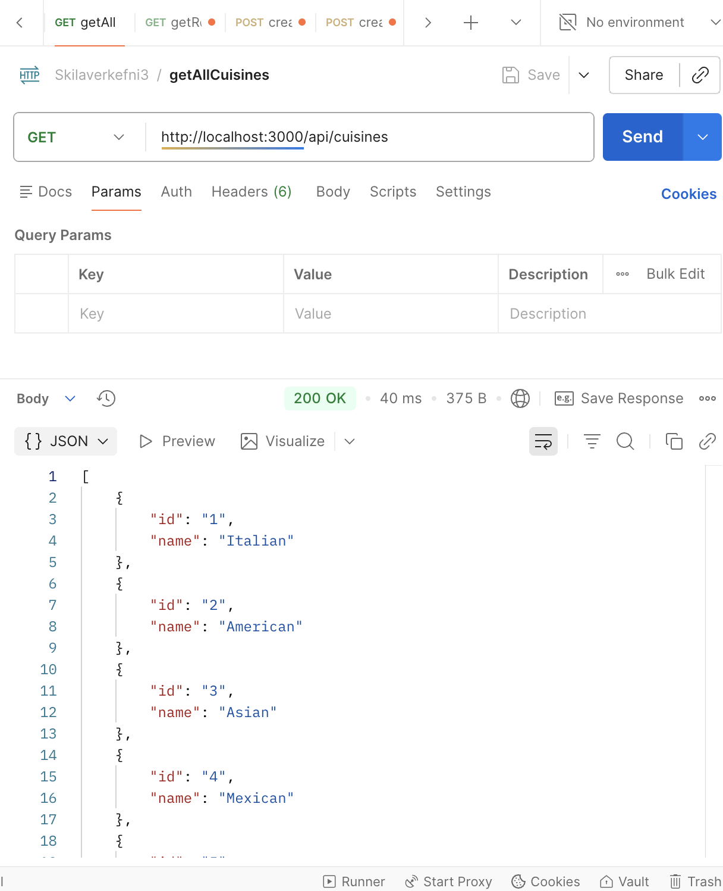
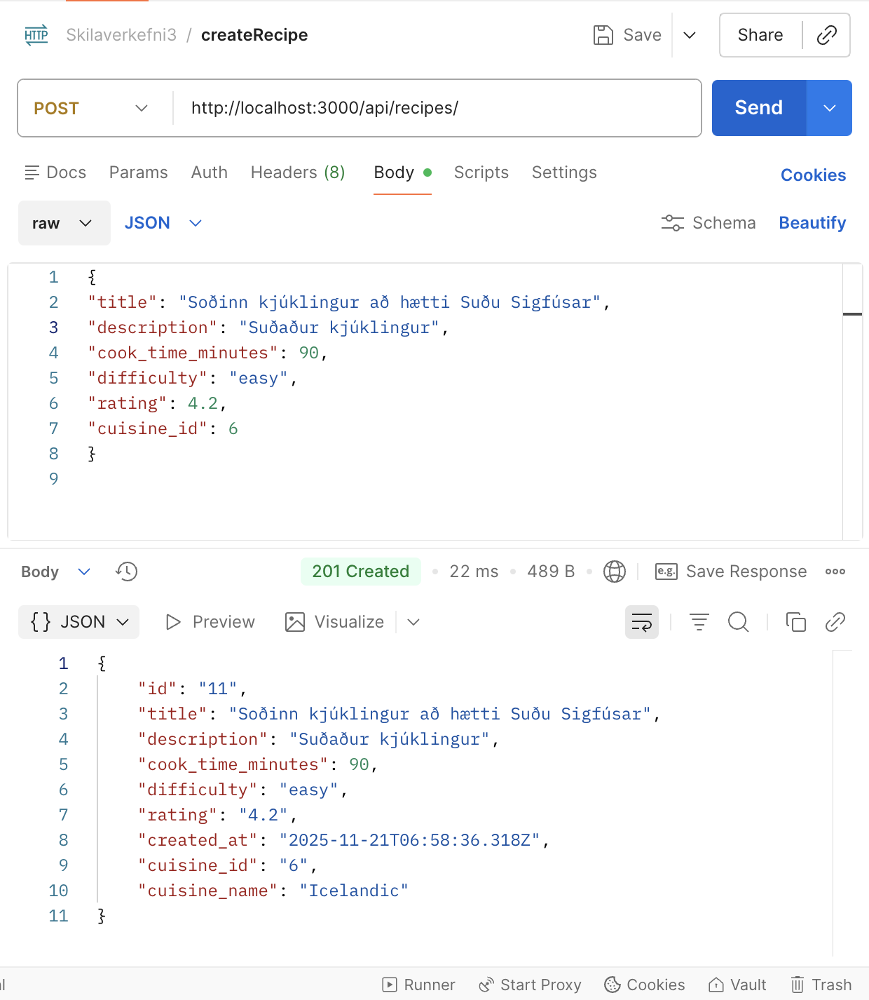
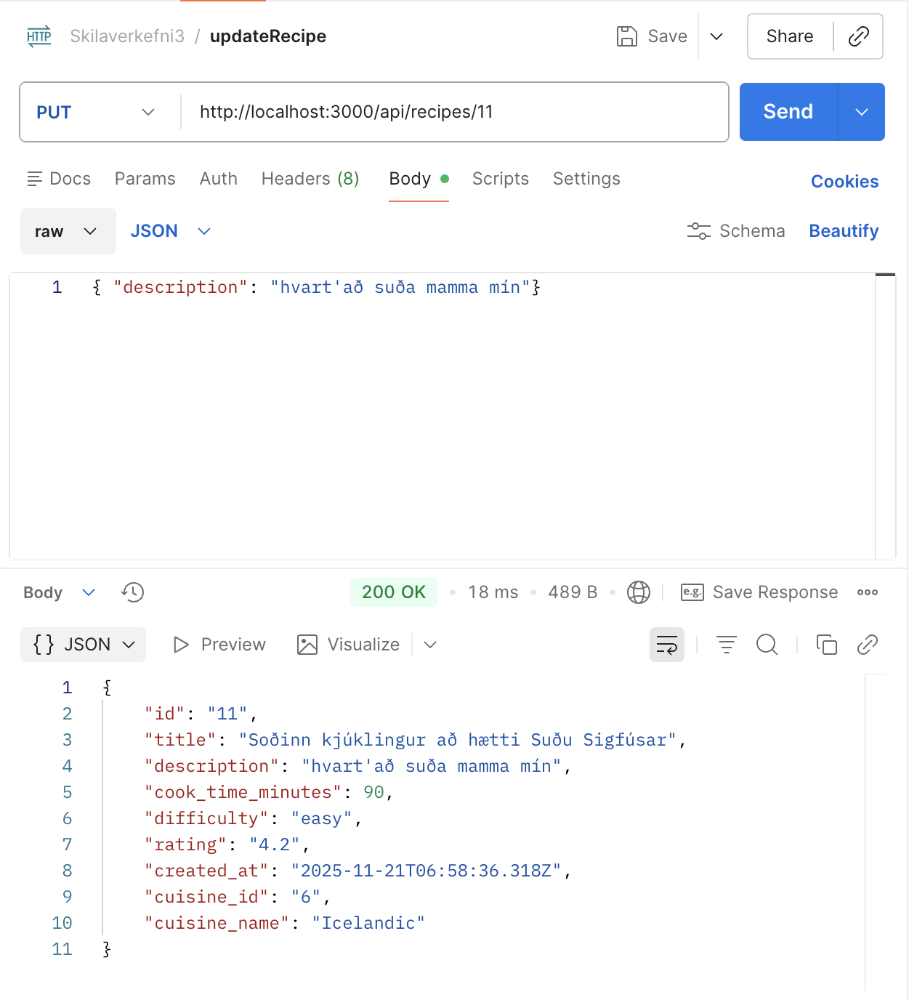
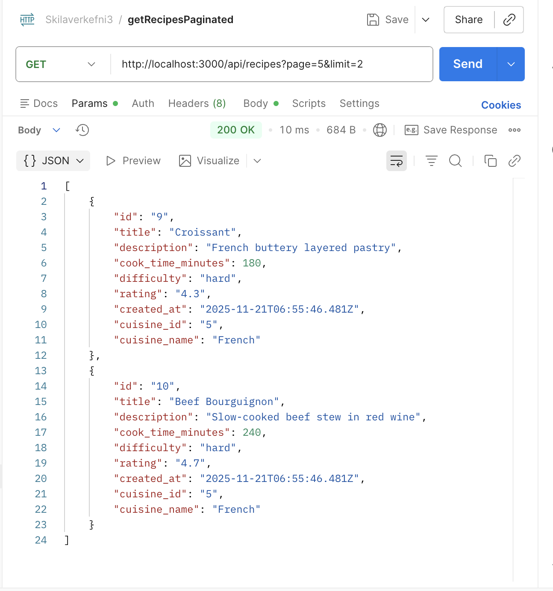
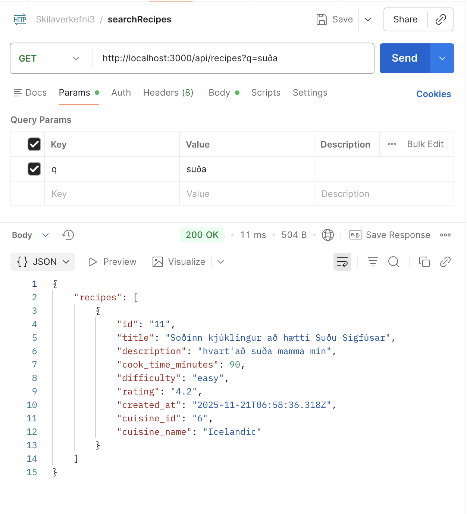
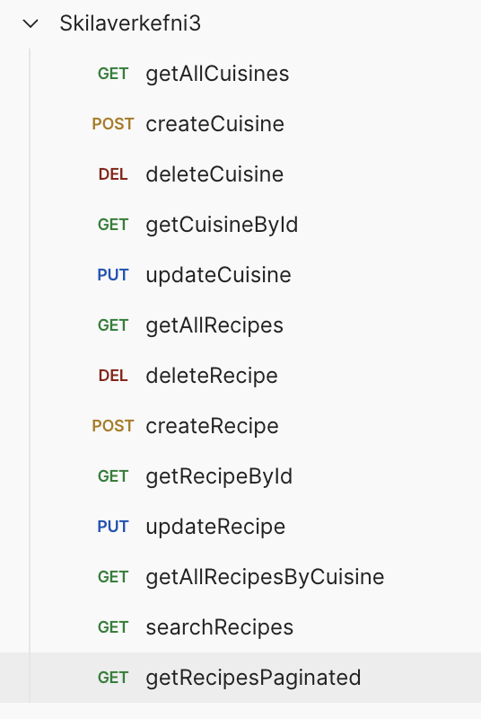

# Skilaverkefni 3: Express API með PostgreSQL

Verkefni fólst í að byggja REST API með Express verkefni tengt við PostgreSQL gagnagrunn með pg-promise.

- **Nemandi** Berglind Rósa Halldórsdóttir
- **Sett fyrir:** [Dagsetning] 8. Nov
- **Skilað:** [Dagsetning] 21. Nov 2025

## Yfirlit

Markmið verkefnisins voru að:

- ✅ Setja upp Express server með TypeScript -
- ✅ Tengja við PostgreSQL með pg-promise
- ✅ Búa til RESTful endpoints
- ✅ Útfæra CRUD aðgerðir (Create, Read, Update, Delete)
- ✅ Meðhöndla villur og validation
- ✅ Skipuleggja kóða með controllers, models og routes

## Gagnagrunnsskema

Verkefnið byggir á eftirfarandi töflum:

### **Cuisines Table**

```sql
CREATE TABLE cuisines (
    id BIGINT GENERATED ALWAYS AS IDENTITY PRIMARY KEY,
    name VARCHAR(255) NOT NULL UNIQUE
);
```

### **Recipes Table**

```sql
CREATE TABLE recipes (
    id BIGINT GENERATED ALWAYS AS IDENTITY PRIMARY KEY,
    title VARCHAR(255) NOT NULL,
    description TEXT,
    cook_time_minutes INTEGER,
    difficulty VARCHAR(50),
    rating DECIMAL(3,1) CHECK (rating >= 0 AND rating <= 5),
    created_at TIMESTAMPTZ NOT NULL DEFAULT NOW(),
    cuisine_id BIGINT NOT NULL,

    FOREIGN KEY (cuisine_id) REFERENCES cuisines(id) ON DELETE CASCADE
);
```

## Uppsetning

### 1. Setja upp dependencies

```bash
npm install
```

### 2. Búa til gagnagrunn

```sql
CREATE DATABASE recipe_homework;
```

### 3. Búa til töflur

```sql
CREATE TABLE cuisines (
    id BIGINT GENERATED ALWAYS AS IDENTITY PRIMARY KEY,
    name VARCHAR(255) NOT NULL UNIQUE
);

CREATE TABLE recipes (
    id BIGINT GENERATED ALWAYS AS IDENTITY PRIMARY KEY,
    title VARCHAR(255) NOT NULL,
    description TEXT,
    cook_time_minutes INTEGER,
    difficulty VARCHAR(50),
    rating DECIMAL(3,1) CHECK (rating >= 0 AND rating <= 5),
    created_at TIMESTAMPTZ NOT NULL DEFAULT NOW(),
    cuisine_id BIGINT NOT NULL,
    FOREIGN KEY (cuisine_id) REFERENCES cuisines(id) ON DELETE CASCADE
);
```

## Umhverfisbreytur

Búðu til `.env` skrá (skilað með verkefninu á teams, ekki á git):

```
PORT=3000
PGHOST=localhost
PGPORT=5432
PGDATABASE=recipe_homework
PGUSER=notandi
# PGPASSWORD=valfrjálst
```

## Keyrsla

### Þróunarhamur

```bash
npm run dev
```

### Byggja TypeScript

```bash
npm run build
```

### Keyra build

```bash
npm start
```

API-ið keyrir á:

```
http://localhost:3000
```

## Verkefnisuppbygging

### Möppustrúktúr

```
skilaverkefni-3/
├── screenshots/
│   ├── getAllCuisines.png
│   ├── createCuisine.png
│   ├── createRecipe.png
│   ├── updateRecipe.png
│   ├── getRecipesPaginated.png
│   ├── searchRecipes.png
│   └── all_endpoints.png
│
├── src/
│   ├── app.ts
│   ├── server.ts
│   │
│   ├── config/
│   │   └── db.ts
│   │
│   ├── controllers/
│   │   ├── cuisineController.ts
│   │   └── recipeController.ts
│   │
│   ├── models/
│   │   ├── cuisineModel.ts
│   │   └── recipeModel.ts
│   │
│   ├── routes/
│   │   ├── cuisineRoutes.ts
│   │   └── recipeRoutes.ts
│   │
│   ├── schemas/
│   │   ├── cuisineSchema.ts
│   │   └── recipeSchema.ts
│   │
│   └── middleware/
│   │   ├── validate.ts
│   │   └── errorHandler.ts
│   │
│   └── sql/
│       └── schema.sql
│
├── .env.example
├── package.json
├── package-lock.json
├── tsconfig.json
└── readme_skil.md (this file)
```

## Verkefnakröfur

### Hluti A: Grunnvirkni (60%)

Grunnvirkni fullkláruð:

1. **Uppsetning og tengingar (10%)**
   - ✅ Rétt package.json með öllum dependencies
   - ✅ TypeScript configuration
   - ✅ Gagnagrunnstengingu með pg-promise
   - ✅ Environment variables (.env)

2. **Cuisine API (25%)**
   - ✅ GET /api/cuisines (öll matargerð)
   - ✅ POST /api/cuisines (búa til nýja)
   - ✅ PUT /api/cuisines/:id (uppfæra)
   - ✅ DELETE /api/cuisines/:id (eyða)

3. **Recipe API (25%)**
   - ✅ GET /api/recipes (allar uppskriftir)
   - ✅ GET /api/recipes/:id (ein uppskrift)
   - ✅ POST /api/recipes (búa til nýja)
   - ✅ PUT /api/recipes/:id (uppfæra)
   - ✅ DELETE /api/recipes/:id (eyða)

### Hluti B: Ítarlegri virkni (40%)

Ítarlegri virkni fullkláruð:

5. **Flóknar fyrirspurnir (15%)**
   - ✅ GET /api/cuisines/:id/recipes (allar uppskriftir úr titekinni matargerð)
   - ✅ GET /api/recipes?q=query (leita í uppskriftum og matargerðum)

6. **Validation og Error Handling (15%)**
   - ✅ Input validation í öllum endpoints
   - ✅ Proper HTTP status codes
   - ✅ Error handling middleware
   - ✅ Meaningful error messages

7. **Kóðagæði og skipulag (10%)**
   - ✅ Rétt möppustrúktúr (MVC pattern)
   - ✅ TypeScript interfaces
   - ✅ Consistent naming conventions

## Prófun

### Handvirk prófun með Postman:









## Skil

Kóða skilað á Github:

- ✅ Öllum source kóða
- ✅ package.json og package-lock.json
- ✅ README.md með leiðbeiningum um keyrslu

SKilað aukalega á teams

- ✅ .env skrá

## Viðbótarverkefni (Bonus)

Viðbótarverkefni 1/3 lokið:

- ✅ **Pagination** - Bætt við `?page=1&limit=10` support
